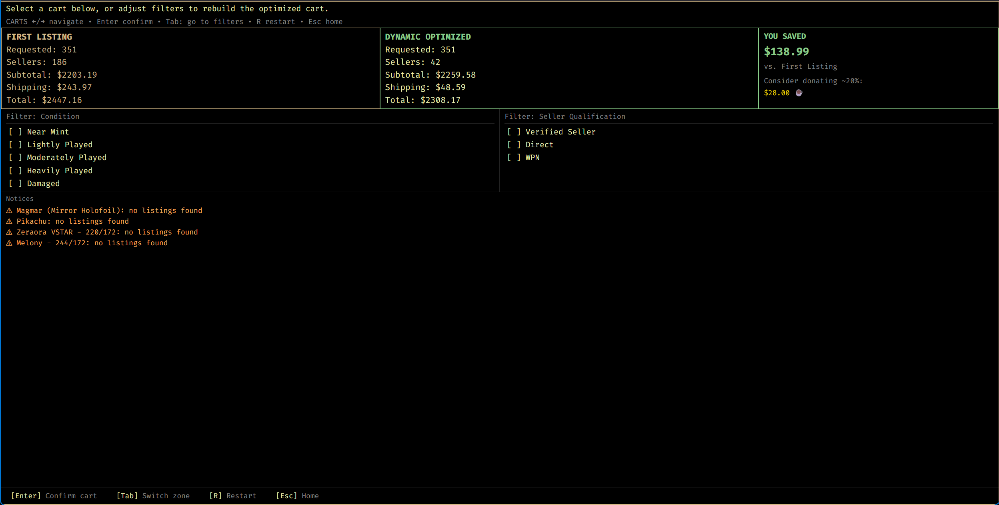
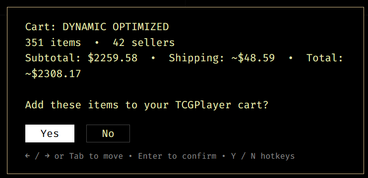
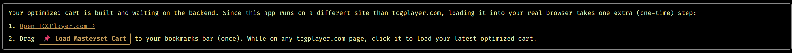

  

# Welcome to masterset (aka TCGScraper)!!

## Intro

This app is designed to help build master sets efficiently and cheaply by scraping live seller data for requested cards from TCGPlayer's website. It then aggressively optimizes by number of sellers and allows the user to dynamically choose filters, and add to the cart in a native browser window when done!

  
<strong>The extensive back-story behind this is this:</strong>

  I took a trip to Japan and when wandering around Tokyo, we stopped in a random konbini that had some Pokémon packs for sale. At this point, I hadn't touched Pokémon cards since I was a kid and figured why not, even though they're Japanese it would be cool for the nostalgia. This happened to be the release day of the Ninja Spinner set ... although I didn't realize it until after I bought the packs!

  I ripped the 5 packs I bought and hit the Mega Dragalge and was super excited and remembered why this was so fun as a kid. I came home and immediately fell into the rabbit hole that is Pokémon cards today. I rediscovered some good things like people enjoying the cards, the community created because of it, more kids getting back into it and just the pure fun of the game that has been around for so long. I also discovered some of the scars of the hobby that exist today like scalping, weighing packs, re-packing, people using wild techniques to try to identify if a pack has hits and just the sheer disgust that I had for the actions of the few that impact the many.

  Regardless, in my research I also stumbled upon the VSTAR Universe/Crown Zenith set. I immediately fell in love with some of the art and how different it was from the any other Pokémon card/set I had seen before. The Hisuian Zoroark, the Galarian Moltres, the Thievul and of course the Palkia/Dialga/Giratina/Arceus cards were all so intriguing! I bought some VSTAR Universe packs on eBay and was hooked - I figured I might as well master set.

  But after realizing that I'd probably go broke in the process of trying to rip my way to a master set I realized it would be way more economical to just buy the singles. But I had a dilemma. I still needed 207 out of the 351 cards and finding all of those on TCGPlayer would not only be tedious, but I'd also waste a bunch of money on shipping because I'd probably end up with 207 different sellers. That's when I found TCG's optimizer ... and how it doesn't work on Pokémon Japan :(

  So I decided to make this and add every single automation/helper feature I could to make it as easy as possible for myself to master set and hopefully help anyone else that's in a similar situation.

  This works regardless of TCG and dynamically pulls data from TCGPlayer's website on every run so you're always getting the freshest data, especially the seller listings. It is limited to sets that have a 'price guide' associated with them so new/old sets or obscure sets from not as popular games won't work.

 

Thanks for stopping by and happy collecting!

---

## App Flow

### Main page
- Starting the app, you're greeted by a splashcreen and taken to the 'main page'. This lets you enter the main function scraping data by TCG.
    - ** Note ** I'm working on the ability to choose a character from any game to scrape all the existing cards of that character (think collecting all Gengars) and be able to choose the one's you'd like to optimize

### Card Choices and Scraping
- From there, you'll be guided through the flow of selecting a game, a set, and the desired cards from that set
- You can scrape cards from multiple sets if desired
- After finishing card selection, the scraper will do its work and bring you to the Dynamic Optimizer page

### Dynamic Optimizer

  

- This is the bread and butter of this tool and what makes it unique! It will optimize all cards from all games/sets without limitations to languages or TCG.
- The optimizer does an aggressive optimization based on minimizing the number of sellers (thus greatly reducing shipping costs in requests with many cards).
- Here is where you can choose which 'cart' you'd like to add to a real TCG Player cart if you'd like!
- You can choose to add either:
    - The baseline 'first listings' cart where it just chose the first (i.e. cheapest) listing on TCG Player for each requested card or ...
    - The Dynamic Cart choice. This defaults to the filters of allowing only 'Near Mint' and 'Lightly Played' cards (if that still results in a cheaper cart, if not no filters will be applied)
        - In the bottom section you can actively adjust filters to see how the dynamic optimizer changes price.
        - When filters get too restrictive, thus preventing any seller listings from matching those conditions, you'll be provided with notices below as to which cards didn't meet those criteria and why
- The cheapest cart will be highlighted in green, and pressing enter on your selected cart will give you the option to add these to a cart

### Adding to a Cart and Saving for Later

  

- The cart create screen will send a bunch of API calls to TCG Player and will create a bookmarklet for you to use to batch add everything to your TCGPlayer cart! 
- All you have to do is have tcgplayer's website open, save the bookmarklet generated and click on it to add your selected cards to the cart.

  

- From here you can admire the convenience, edit the cart, add new cards or start over
- You can also save these cards for later or even go through with your purchase

## Website

- This website is hosted in two separate ways
  - The backend is hosted by Railway
  - The frontend is hosted by GitHub Pages
- The stable (production) link for this app is `https://jdenaro98.github.io/masterset/`

## Development Via VS Code and Dev Containers

### Dependencies
- [Docker Desktop](https://www.docker.com/products/docker-desktop/) **Ensure docker is running (and open for macOS)**
- [VS Code](https://code.visualstudio.com/) with the [Dev Containers extension](https://marketplace.visualstudio.com/items?itemName=ms-vscode-remote.remote-containers)

### VS Code
1. Clone the repo: `git clone https://github.com/jdenaro98/masterset.git`
2. Open the folder in VS Code
3. When prompted **"Reopen in Container"**, click it — or open the Command Palette (`Ctrl+Shift+P` / `Cmd+Shift+P`) and run **Dev Containers: Reopen in Container**
4. Wait for the container to build and `postCreateCommand` to finish — this installs all dependencies and downloads Playwright Chromium. **First build only**, subsequent starts are fast.

### CLI
1. Clone the repo: `git clone https://github.com/jdenaro98/masterset.git`
2. In a bash window in the root of the repo type `./launch_devcontainer.sh`
    - This will launch the devcontainer in the same way that VS Code does, just in your own CLI **Must have npm devcontainers installed**
3. Wait for the container dependencies to pull and you'll be greeted with the workspace CLI entry

5. Run `npm run dev` to start the Vite backend live server
6. Navigate to **`localhost:5173`** to access the webiste
7. If you want to test the 'add to cart' feature, you'll also have to open a tab with `https://localhost:8000` and proceed past security warnings
    - This is required to process the add to cart calls when developing locally, this mechanism is hosted on Railway in the production site.

## Planned Features (future)
- Optimize by character
    - i.e. be able to masterset a specific character and choose which remaining cards you still need
- Full mobile web app
    - Right now the browser only kind of works natively with a mobile phone
- Input validation to save/load feature for card selection files
    - Right now it just validates raw against the card name from tcgplayer and would break if any cards from another set found their way into a card save file
    - I'd like to add metadata to the card for the system to validate againts
- Rework the app flow to be less of a linear 'one direction' type of progression and more of a browsable page
- Add mouseover picture pop-ups to each card to more easily identify which card you're selecting